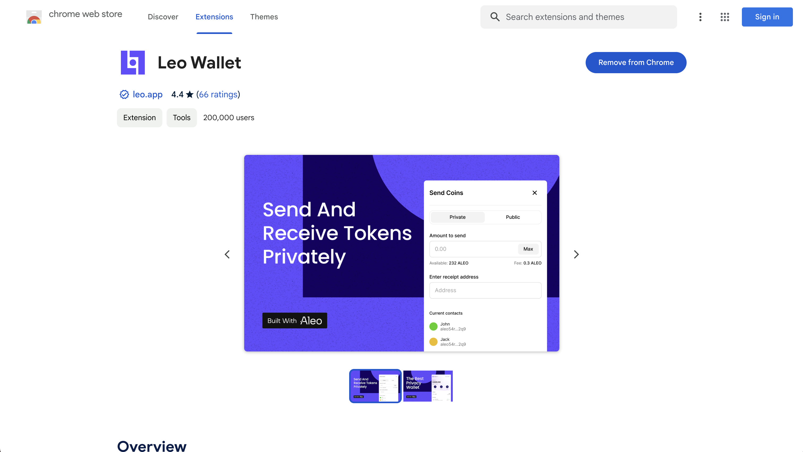
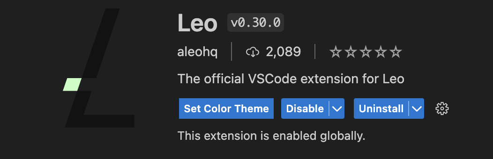
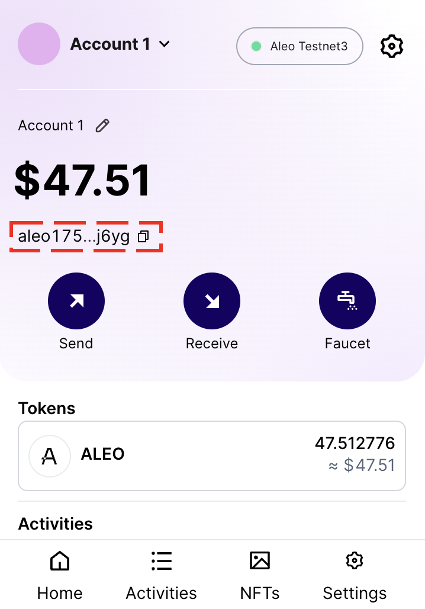
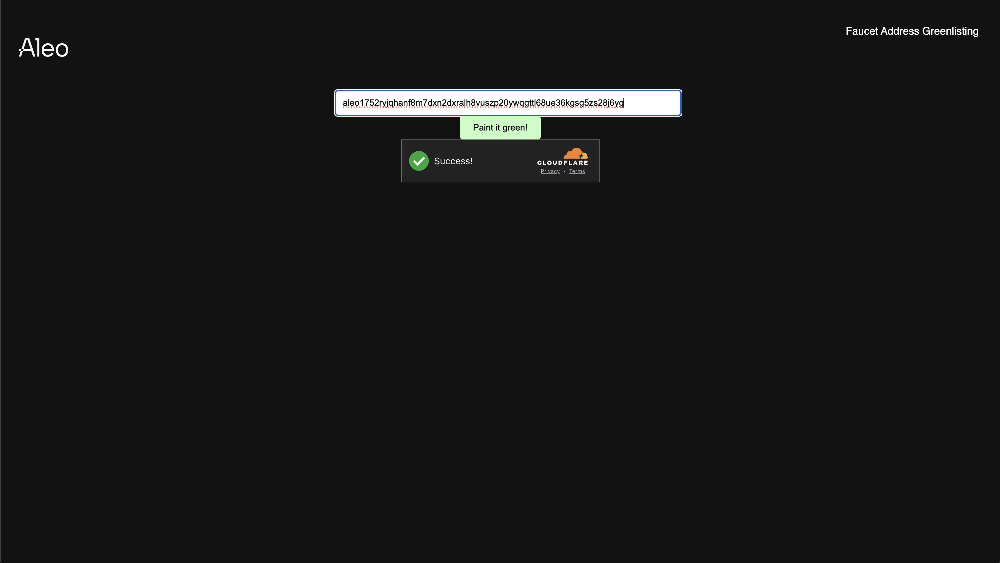
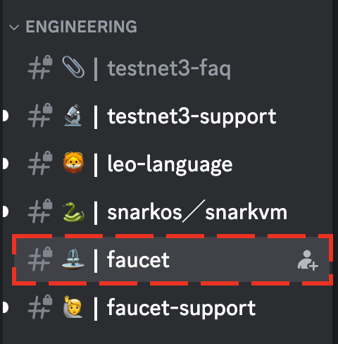
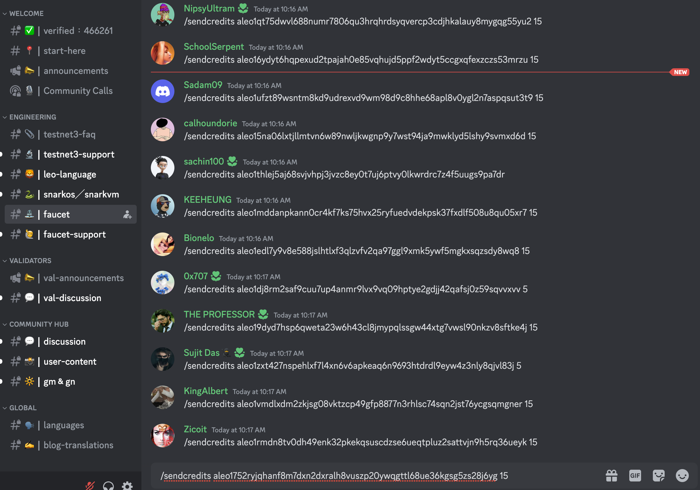
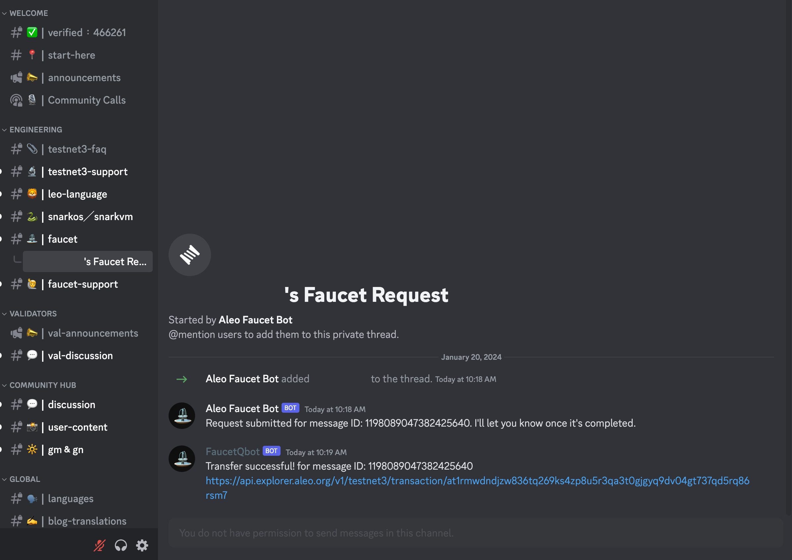
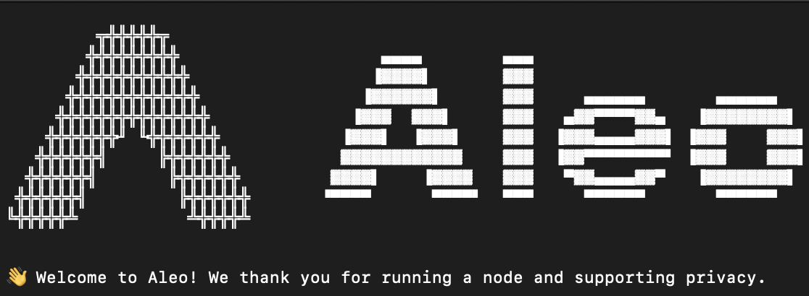

<!-- <h1 align="center">Aleo Workshop</h1> -->

<h3 align="center">📜 A starter guide to build applications on Aleo 📜</h3>

<p align="center">
    <a href="https://twitter.com/AleoHQ"></a>
    <a href="https://aleo.org/discord"></a>
</p>

## Table of Contents
- [Workshop Preparation Guide](#workshop-preparation-guide)
    - [Prerequisites](#prerequisites)
    - [Installation](#installation)
- [IDE Support](#ide-support)
    - [VSCode](#vscode-preferred)
    - [Sublime Text](#sublime-text)
    - [IntelliJ IDEA](#intellij-idea)
- [Testnet Credits](#testnet-credits)
- [Application Walkthroughs](#application-walkthrough)
    - [🪙 Token](#-token) ([Source Code](./src))
- [Local Development](#local-development)
- [Testnet Development](#testnet-development)
- [Useful Links](#useful-links)


## Workshop Preparation Guide

The following steps will install Aleo and Leo on your machine. This workshop is compatible on macOS, Linux, and Windows machines.

### Prerequisites

This workshop requires the following prerequisites.

- Install `git` with [bit.ly/start-git](https://bit.ly/start-git)
- Install `Rust`with [bit.ly/start-rust](https://bit.ly/start-rust)

### Installation
Follow the instructions at the following links to install the required software.

#### snarkOS
https://github.com/AleoHQ/snarkOS

#### snarkVM
https://github.com/AleoHQ/snarkVM

#### Leo
https://developer.aleo.org/leo/installation/

#### Leo Wallet
https://chromewebstore.google.com/detail/leo-wallet/nebnhfamliijlghikdgcigoebonmoibm



## IDE Support

This workshop requires one of the following IDEs.
- [VSCode](https://bit.ly/start-vscode)
- [Sublime Text](https://bit.ly/start-sublime)
- [IntelliJ IDEA](https://bit.ly/start-intellij)

### VSCode (Preferred)

Start by installing `VSCode` with [bit.ly/start-vscode](https://bit.ly/start-vscode).

#### Next, in VSCode, open the **VSCode Marketplace**, type **Leo** into the search bar, and proceed to install the Leo plugin.


### Sublime Text

<details><summary>Installation Steps</summary>

Start by installing `Sublime Text` with [bit.ly/start-sublime](https://bit.ly/start-sublime).

#### Next, in Sublime Text, install [Package Control](https://packagecontrol.io):
- On Windows/Linux: `ctrl + shift + p`, type **Install Package Control**, and press **Enter**.
- On macOS: `cmd + shift + p`, type **Install Package Control**, and press **Enter**.

#### Next, in Sublime Text, install [LSP](https://packagecontrol.io/packages/LSP):
- On Windows/Linux: `ctrl + shift + p`, select **Package Control: Install Package**, type **LSP**, and press **Enter**.
- On macOS: `cmd + shift + p`, select **Package Control: Install Package**, type **LSP**, and press **Enter**.

#### Lastly, in Sublime Text, install [LSP-leo](https://packagecontrol.io/packages/LSP-leo):
- On Windows/Linux: `ctrl + shift + p`, select **Package Control: Install Package**, type **LSP-leo**, and press **Enter**.
- On macOS: `cmd + shift + p`, select **Package Control: Install Package**, type **LSP-leo**, and press **Enter**.

</details>

### IntelliJ IDEA

<details><summary>Installation Steps</summary>

Start by installing `IntelliJ IDEA` with [bit.ly/start-intellij](https://bit.ly/start-intellij).

#### Next, in IntelliJ IDEA, open the **IntelliJ Marketplace** and select `Plugins`:
- On Windows/Linux: `ctrl + ,` and select `Plugins` on the left hand bar
- On macOS: `cmd + ,` and select `Plugins` on the left hand bar

Lastly, type **Leo** into the search bar, and install the official Leo plugin.

</details>


---
## Receiving Testnet Credits

1) Fill in your Aleo wallet address at https://forms.gle/2MuBVACfhuQFuCZw7 (Fill in only once)

2) Wait for us to send it to you.
<!-- NOTE: You can only request max of 15 credits per day.

1) Join the Aleo Discord: https://discord.gg/aleo
2) Go to your Leo wallet and copy your Aleo Wallet Address



3) Go to https://faucetgreenlist.snarkos.net to greenlist your wallet address. NOTE: The greenlist only lasts for 5 mins, so you have to execute the next steps fast.



4) Go to the faucet channel on Aleo Discord.



5) Type 

```
/sendcredits <ALEO_ADDRESS> 15
```
Example:

```
/sendcredits aleo1752ryjqhanf8m7dxn2dxralh8vuszp20ywqgttl68ue36kgsg5zs28j6yg 15
```




6) A bot should message you to notify you of your request. Wait for a sucessful response.




7) You have now received Aleo public credits! -->

---
## Application Walkthrough

This workshop walks through the following application:
- [token](./) - A transparent & shielded custom token in Leo


### 🪙 Token

A transparent & shielded custom token in Leo.
We will create an application that allows you to mint private and public tokens.

##### Learning objectives
- Understand how to store information and modify state privately in records
- Understand how to store information publicly using mapping.
- Learn how to deploy a Leo program onto the Aleo testnet.
- Learn how to make public to private and private to public calls.


---

## Usage

Clone the repo
```
git clone https://github.com/Aleo-DevRel-Ambassadors/zkWorkshop_SG_SMU_240131.git
```

Enter the directory
```
cd zkWorkshop_SG_SMU_240131
```

Run some Leo CLI commands

```
leo run create_record
```


## Local Development

### Start a local devnet
Go to your snarkOS folder

Run
```
./devnet.sh
```

You should see



--- 

### To deploy your program:

```
snarkos developer deploy <PROGRAM_NAME> --private-key <PRIVATE_KEY> --query "http://localhost:3033" --path ".build/" --broadcast "http://localhost:3033/testnet3/transaction/broadcast" --priority-fee 0

```
Example:

```
snarkos developer deploy my_token_1402.aleo --private-key APrivateKey1zkpBjpEgLo4arVUkQmcLdKQMiAKGaHAQVVwmF8HQby8vdYs --query "http://localhost:3033" --path "./build/" --broadcast "http://localhost:3033/testnet3/transaction/broadcast" --priority-fee 0
```

### To execute a function of your program

```
snarkos developer execute <PROGRAM_NAME> <FUNCTION_NAME> <INPUT_ARGUMENTS> --private-key <PRIVATE_KEY> --query "http://localhost:3033" --broadcast "http://localhost:3033/testnet3/transaction/broadcast"

```

Example:

```
snarkos developer execute my_token_1402.aleo create_record --private-key APrivateKey1zkpBjpEgLo4arVUkQmcLdKQMiAKGaHAQVVwmF8HQby8vdYs --query "http://localhost:3033" --broadcast "http://localhost:3033/testnet3/transaction/broadcast" 
```

### To scan for your records

```
snarkos developer scan -v <VIEW_KEY> --start 0 --end 1 --endpoint "http://localhost:3033"

```

Example:

```
snarkos developer scan -v AViewKey1iKKSsdnatHcm27goNC7SJxhqQrma1zkq91dfwBdxiADq --start 0 --end 1 --endpoint "http://localhost:3033"

```

---

## Testnet Development

Similar steps as above, but using different API endpoints and specifying record

Query: https://api.explorer.aleo.org/v1

Broadcast: https://api.explorer.aleo.org/v1/testnet3/transaction/broadcast


Deploy Command

```
snarkos developer deploy <PROGRAM_NAME> --private-key <PRIVATE_KEY> --query "https://api.explorer.aleo.org/v1" --path "./build/" --broadcast "https://api.explorer.aleo.org/v1/testnet3/transaction/broadcast" --priority-fee 0

```

Example

```
snarkos developer deploy my_token_1402.aleo --private-key "<PRIVATE_KEY>" --query "https://api.explorer.aleo.org/v1" --path "./build/" --broadcast "https://api.explorer.aleo.org/v1/testnet3/transaction/broadcast" --priority-fee 0
```

Execute Example
```
snarkos developer execute my_token_1402.aleo mint_private "{
  owner: aleo1752ryjqhanf8m7dxn2dxralh8vuszp20ywqgttl68ue36kgsg5zs28j6yg.private,
  amount: 0u64.private,
  _nonce: 1968575589767858545246054726745663720563234710655185570269196653250325306476group.public
}" 7u64 --private-key <PRIVATE_KEY> --query "https://api.explorer.aleo.org/v1" --broadcast "https://api.explorer.aleo.org/v1/testnet3/transaction/broadcast" --priority-fee 0 --record "{
  owner: aleo1752ryjqhanf8m7dxn2dxralh8vuszp20ywqgttl68ue36kgsg5zs28j6yg.private,
  microcredits: 2514698u64.private,
  _nonce: 7397027231458557903930913012007952420218292833579405184292792278228120786092group.public
}"
```

## Useful Links
- [Learn Leo](https://developer.aleo.org/leo/)
- [Developer Documentation](https://developer.aleo.org/testnet/getting_started/overview)
- Aleo Explorers
    - [Aleo Explorer](https://explorer.aleo.org)
    - [Haruka's Aleo Explorer](https://explorer.hamp.app)
    - [Aleo123](https://aleo123.io)
- Aleo Resources
  - [Leo Playground](https://play.leo-lang.org)
  - [Aleo SDK] (https://aleo.tools/account)